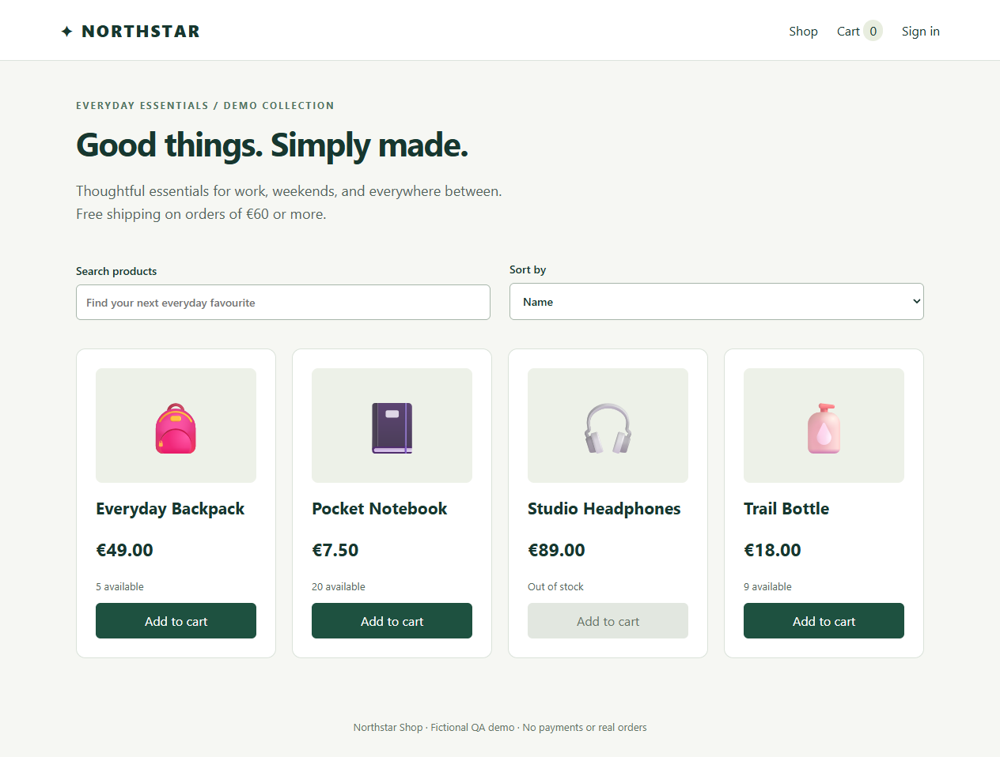

# Steve Knox · QA Automation Portfolio

An employer-reviewable **Playwright + TypeScript** test suite for Northstar Shop, a fictional e-commerce demo included in this repository. It covers authentication, checkout validation, cart regressions, API contracts, negative cases, and failure investigation.

The focus is junior QA automation: readable scenarios, meaningful assertions, independent test data, and reproducible evidence. This is a personal, AI-assisted portfolio project, not paid client work or testing of a production retailer. Steve should review and be able to explain the scenarios before presenting them in interviews.

**Verified locally, 16 September 2026:** 25 API checks plus 29 browser cases in each of Chromium and Firefox — **83 passed, 0 failed, 0 skipped**. Lint and types passed. [Run details and saved reports](docs/verification.md).



## Start here

1. Install Node.js 22.13+ (22.x) or 24+ and open a terminal in this project folder.
2. Run:

```sh
npm ci
npx playwright install chromium firefox
npm run check
npm run report
```

`check` runs lint, TypeScript checking, then the API suite once and browser scenarios in Chromium and Firefox. Playwright starts and stops the local shop automatically. Linux machines may need `npx playwright install --with-deps chromium firefox`.

For a visible browser walkthrough, run `npm run test:headed`. For interactive test exploration, run `npm run test:ui`.

To explore the shop manually, run `npm start` and open <http://127.0.0.1:4187>. Sign in with **steve@example.test / DemoPass123!**. These are public fictional credentials. Stop this manual server before running tests: tests deliberately refuse to reuse an occupied port.

See [verification evidence](docs/verification.md) for the actual executed results and limitations. Local results do not imply that GitHub Actions has run.

## Why this target?

Northstar Shop is a small, self-contained storefront with four seeded products, login/logout, search, sorting, a cart, shipping validation, and order confirmation. The browser calls a real local HTTP API. Orders are stored in memory within separate sessions.

Keeping the target local avoids shared accounts, external service downtime, and modifying somebody else's site. It also makes fault injection and API/UI consistency checks repeatable. The tradeoff is that this suite demonstrates testing a controlled demo, not an independent commercial application. Tests use documented expected prices and rules, rather than importing calculations from the app under test.

## What an employer can review

| Skill | Example |
|---|---|
| End-to-end workflow | `SHOP-01` adds two products, checks totals, places an order, reads it back through the API, and checks the cart cleared |
| Boundary analysis | Names of 1/2/60/61 characters, stock limits, quantities, postcodes, and the €60 shipping threshold |
| Negative API testing | Malformed JSON, anonymous access, tampered prices, duplicate products, invalid quantities |
| Maintainable automation | Role/label locators, three small page objects, isolated fixtures, data-driven cases |
| Failure investigation | Separate deliberate price regression with a failing assertion, screenshot, trace, and an expected-versus-actual report |
| Repeatable delivery | Lockfile, lint/type checks, smoke/regression scripts, and a GitHub Actions workflow |

## Project map, in plain English

```text
.github/workflows/qa.yml       CI instructions and report uploads
demo/
  server.mjs                  Local HTTP API, demo sessions, order validation
  public/index.html           Page shell and navigation
  public/app.js               Storefront interactions and API requests
  public/style.css            Storefront styling and responsive layout
tests/
  data.ts                     Fictional account and shipping details
  fixtures.ts                 Fresh page objects and optional API login per test
  pages/LoginPage.ts          Reusable sign-in actions
  pages/ShopPage.ts           Product selection and cart navigation
  pages/CheckoutPage.ts       Shipping form actions
  e2e/login.spec.ts           Sign-in, sign-out, session, and guest access tests
  e2e/checkout-validation.spec.ts  Data-driven field and boundary tests
  e2e/shopping.spec.ts        Buying, cart, search, and sorting regressions
  e2e/edge-cases.spec.ts      Stock/quantity limits and service-failure recovery
  api/shop-api.spec.ts        HTTP status, response content, and stored-state checks
evidence-demo/e2e/           One deliberately failing price-regression test
scripts/failure-demo.mjs     Runs that demonstration separately
docs/test-plan.md            Requirements, coverage, priorities, and test approach
docs/defect-example.md       Reproducible injected-defect investigation
docs/verification.md         Actual local run record
playwright.config.ts        Browsers, server, isolation, timeouts, reports, traces
eslint.config.mjs           Basic JavaScript and TypeScript code checks
tsconfig.json               Strict TypeScript checks for test code
package.json / package-lock.json  Commands and pinned dependency tree
```

The demo uses plain JavaScript to keep the target small. The automation, fixtures, page objects, and Playwright configuration use TypeScript. There is no custom test runner or broad base-page inheritance.

## Commands

| Command | Purpose |
|---|---|
| `npm test` | API once plus Chromium and Firefox browser suites |
| `npm run test:smoke` | Tagged critical checks across the configured projects |
| `npm run test:regression` | All current functional cases tagged `@regression` |
| `npm run test:api` | HTTP checks without launching a browser |
| `npm run test:e2e` | Chromium browser scenarios only |
| `npm run test:cross-browser` | Chromium and Firefox browser scenarios |
| `npm run test:headed` | Chromium scenarios in visible browsers |
| `npm run test:ui` | Interactive Playwright test runner |
| `npm run lint` | Check basic code-quality rules |
| `npm run typecheck` | Check TypeScript types without building files |
| `npm run check` | Lint, types, and complete normal suite |
| `npm run report` | Open the latest normal HTML test report |
| `npm run test:failure-demo` | Deliberately fail one isolated demonstration; expected exit code **1** |

Run a single scenario with `npx playwright test --project=chromium --grep SHOP-01`.

## Reports and debugging

Normal runs create `playwright-report/index.html`, machine-readable `playwright-report/results.json`, and test artifacts in `test-results/`. The configuration takes a screenshot only on browser-test failure and records a trace that is retained if its test fails. No retry is required to get the first failure evidence. API-only tests have no page to screenshot.

Open a failed test in the HTML report to inspect its assertion, screenshot, and trace. A trace shows actions, page snapshots, and network activity. You can also run `npx playwright show-trace <path-to-trace.zip>`.

To see a real generated failure artifact on demand:

```sh
npm run test:failure-demo
npx playwright show-report failure-demo-report
```

Expect exactly one failed test: the injected price change makes the displayed total €22.96, while the test expects the documented €22.95. This command intentionally exits 1. It does not change application source or overwrite the normal report. See [the investigation](docs/defect-example.md). Failure traces contain only fictional data, but always review artifacts before sharing them.

## Test design and scope

- Each Playwright test gets an isolated browser context or request context. API-created sessions are unique even though the fictional account is the same.
- The authenticated fixture signs in through the real API for shopping setup. Separate login tests exercise the sign-in page.
- Assertions remain in tests; page objects hold reusable actions and locators. Tests assert outcomes and saved state, not just successful clicks.
- Two workers, no fixed sleeps, and no automatic retries keep runs readable and failures visible. Test ordering is not a dependency.
- Most tests use the real demo API. Two browser edge tests simulate unavailable services; the separate failure demonstration alters a response deliberately.
- A traceability table and business rules are in [the test plan](docs/test-plan.md).

## CI and honest limits

The supplied GitHub Actions workflow installs dependencies and both browsers, runs `npm run check`, and uploads reports even when tests fail. It is ready to run when this directory is the root of a GitHub repository. No repository has been published by this project build, and CI is not claimed as verified until a real workflow run succeeds.

This demo has no payment integration, durable database, account registration, production password storage, cross-session inventory depletion, or order idempotency service. Orders disappear when the server stops; sessions expire after one hour. Cart state survives reload within a tab and clears on logout. Stock is a fixed per-order limit, not a warehouse inventory model. Postcodes deliberately follow a five-digit rule. Confirmation is temporary; reloading it returns to the catalog.

These are functional tests. They do not establish production security, load/performance, WCAG compliance, mobile device coverage, WebKit/Safari compatibility, or test coverage of an outside retailer. Accessible locators improve test resilience but are not an accessibility audit.

## Interview walkthrough

Start with `SHOP-01`, explain why saved order verification matters, then walk through the field boundaries and price-tampering API test. Run the deliberate failure demo and show how the trace helps distinguish an incorrect expectation from a real changed value. Explain why test isolation and a documented local target make results repeatable.

Author portfolio: [Steven Knox on GitHub](https://github.com/sknox698-del) · [LinkedIn](https://www.linkedin.com/in/steven-knox-4a16aa253/)

Reference documentation: [Playwright configuration](https://playwright.dev/docs/test-configuration), [web server](https://playwright.dev/docs/test-webserver), [API testing](https://playwright.dev/docs/api-testing), [trace viewer](https://playwright.dev/docs/trace-viewer).
